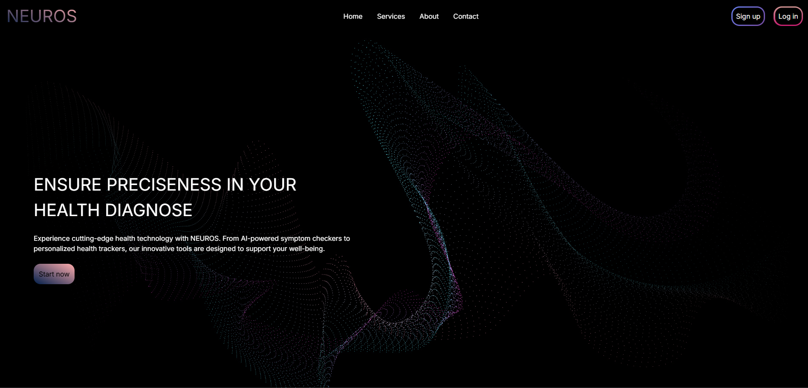
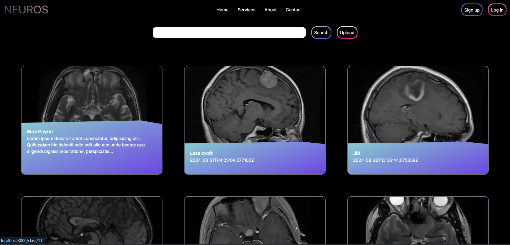

# BRAIN DISEASE CLASSIFICATION USING MRI IMAGEs

This backend use Resnet34 model with ~94% accuracy. The model's file was so big that I cann't push into Github so **the model file: .keras was missing**. However, I will provide the link to model for anyone interested in so you can add into backend and also the Github link to model training page I used to make that model.

Github link:
- Brain tumor detection: 
- Brain tumor classification:

This project including a tumor detection and brain tumor classification model, however I forgot to separate these 2 so all api and view+model+controller in detc file of backend (●'◡'●)

### Set up
To begin, install requirement package:
In backend:
- Required tensorflow and keras
- Required SQL server (I used mySQL)
- Make sure you install Django with
    'rest_framework',
    'corsheaders',
- Create .env file in backend with SECRET_KEY (but this is for fun, don't mention it) but the DB is a must, contain you config of your database.
- This project won't run with empty model which couldn't upload because the size, so download one or train it yourself. If you need my model, please check out my above github link.
- You also need to change path of the model in /neur/detc/views.py

In frontend:
- Install nessesary modules: `npm install`

### Run backend:
`cd neur`-> `py manage.py runserver`

### Run frontend:
`cd frontend`-> `npm run dev`

App should run on [http://localhost:3000](http://localhost:3000)

